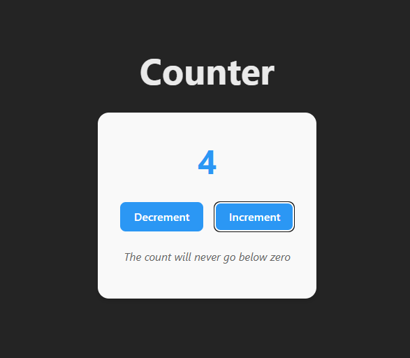

# Counter App

A simple and elegant counter application built with React and Vite. This app allows users to increment and decrement a counter with a clean, modern interface.

## Features

- ➕ **Increment Counter**: Click the increment button to increase the count
- ➖ **Decrement Counter**: Click the decrement button to decrease the count
- 🚫 **Zero Protection**: Counter cannot go below zero
- 🎨 **Modern UI**: Clean and responsive design
- ⚡ **Fast Performance**: Built with Vite for optimal development and build performance

## Live Demo


## Screenshots




## Getting Started

### Prerequisites

- Node.js (version 14 or higher)
- npm or yarn

### Installation

1. Clone the repository:
   ```bash
   git clone https://github.com/she1da/my-counter-app.git
   cd my-counter-app
   ```

2. Install dependencies:
   ```bash
   npm install
   ```

3. Start the development server:
   ```bash
   npm run dev
   ```

4. Open your browser and navigate to `http://localhost:5173`

### Available Scripts

- `npm run dev` - Start the development server
- `npm run build` - Build the app for production
- `npm run preview` - Preview the production build
- `npm run lint` - Run ESLint for code quality checks

## Tech Stack

- **React 19** - Frontend library
- **Vite** - Build tool and development server
- **ESLint** - Code linting and formatting
- **CSS3** - Styling

## Project Structure

```
my-counter-app/
├── public/                 # Static assets
├── src/
│   ├── components/        # React components
│   │   └── Counter.jsx   # Main counter component
│   ├── assets/           # Images, fonts, etc.
│   ├── App.jsx           # Main app component
│   ├── App.css           # App styles
│   ├── main.jsx          # Entry point
│   └── index.css         # Global styles
├── package.json          # Dependencies and scripts
├── vite.config.js        # Vite configuration
└── README.md            # Project documentation
```

## How It Works

The counter app uses React's `useState` hook to manage the counter state. The component includes:

- State management for the counter value
- Increment function that increases the count by 1
- Decrement function that decreases the count by 1 (with zero protection)
- Conditional button disabling when count reaches zero

## Contributing

1. Fork the repository
2. Create a feature branch: `git checkout -b feature-name`
3. Commit your changes: `git commit -m 'Add some feature'`
4. Push to the branch: `git push origin feature-name`
5. Submit a pull request


## Author

[Sheyda Ahmadi Pour](https://github.com/she1da)

---

Made with ❤️ using React and Vite
